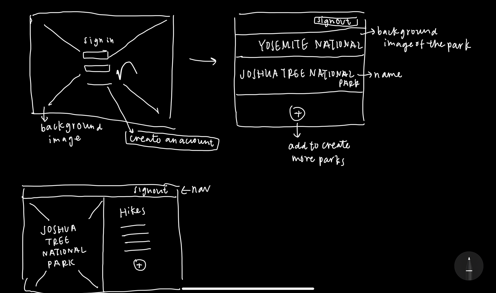

# My National Park App - client

## Summary
This full stack application is designed for users keeping track of their experience in national parks they have visited.

Once user signed up and/or signed in, user can add parks they visited. User can update or delete each park. They can also change password and sign out under the profile dropdown menu.

## Important Links
https://tiffyyc.github.io/my-national-parks-client/

## User Stories
- As a user, I can sign up to an account with email address.
- As a user, I can sign in with email and password.
- As a user, I can change password after signing in.
- As a user, I can sign out.

- As a user, I can create park on the profile.
- As a user, I can show(see) all parks.
- As a user, I can update park.
- As a user, I can delete park.

- As a user, I can create(add) trails to parks.
- As a user, I can show(see) all trails.
- As a user, I can update trails I went to.
- As a user, I can delete trails.

## Technologies Used
- jQuery
- HTML/CSS
- Bootstrap
- Javascript

## Wireframes

